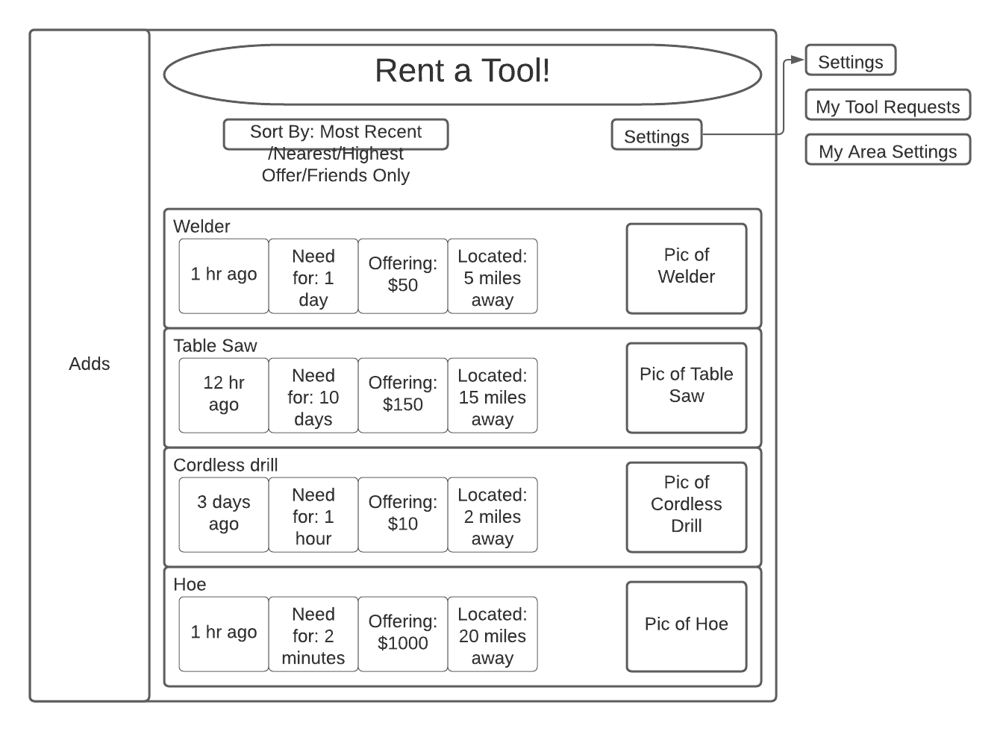
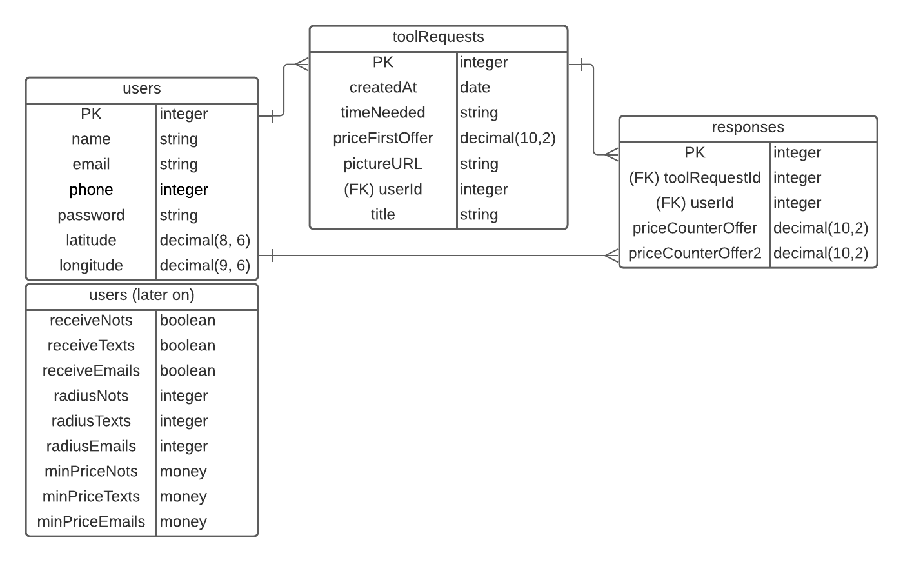

# Oo I Have That

### OoIHaveThat is a peer to peer tool sharing platform.
### What differentiates OoIHaveThat from other platforms is that it starts with the seeker of the tool and not the owner of the tool. So while other platforms traditionally leave it to the owner of a garage full of tools to input each individual tool onto the site in hopes that someone may want to rent or buy them, OoIHaveThat allows a DIY'er to post only when they need a tool and to post exactly what tool they need. Services would also be able to be posted or really anything a person may need.

### Users of the platform are notified of tool requests in 4 possible ways: receiving notification from site/mobile app, receiving email, receiving text message, or visiting the site to see recent tool requests. In this current version (MVP), going to the site is the only possible way to see tool requests.

### Before posting tool requests, users must provide credit card info for the purpose of payment in the event the tool is lost, broken, or stolen. This feature has not been added in the current version.

### Users will have to provide an address so that OoIHaveThat can only show other users the tool requests that are within a configurable distance from them. A google maps API is used to calculate latitude and longitude from the provided address so that a "radius of concern" can be determined.

# Steps to use the site:
### 1. Signup or Login
### 2. Click on 'Home' to view other users' tool requests.
### 3. Click on 'Profile' to view your tool requests along with responses made by other users. Also on the profile page, you can see your responses to other users' tool requests.
### 4. Click on 'Rent a Tool!' to post a tool request.

# Potential Roadblocks

### Prostitution would most certainly become a problem.
### As the site scales, a proportionally large team of lawyers/admins would be required to deal with claims of lost/stolen/broken tools.

# To host this app locally:
### Need MapBox Access Token saved in .env as MAPBOX_ACCESS_TOKEN
### Node packages to install:
### 1. @mapbox/mapbox-sdk
### 2. bcrypt
### 3. dotenv
### 4. ejs
### 5. express
### 6. express-ejs-layouts
### 7. geocoder
### 8. method-override
### 9. passport
### 10. passport-local
### 11. pg
### 12. sequelize
### Note: install node packages by installing node globally then running 'npm i <packageName>'